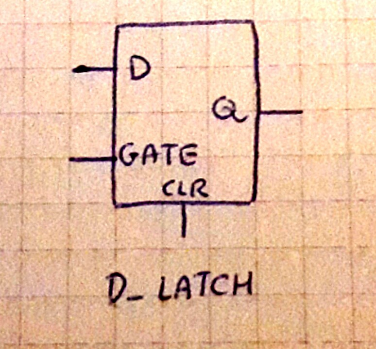

# Latches

Here's a picture of a latch with the D input, a gate control a Q output, and a clear

note: Synchronous logic includes latches and flip flops. Combinatorial logic includes AND gates, OR gates, and NOR gates.
