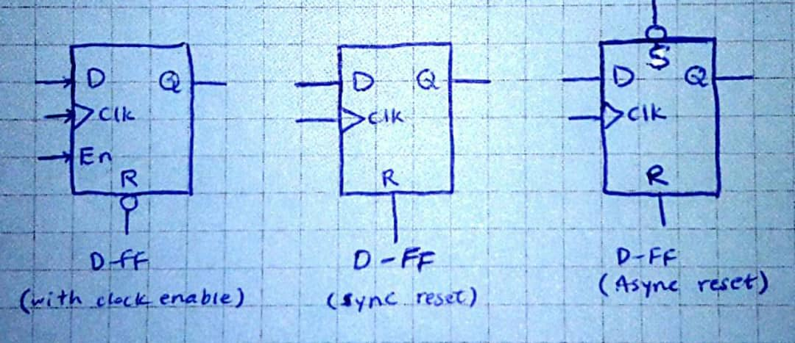

# FFs

Here's three pictures of D flip-flop examples. For each we have a D input, a clock, and a reset as input, and a q as an output.

* [👩‍💻 D_FF with sync reset](https://github.com/Baharkaviani/Battle_over_FPGA/blob/main/project_3_FFs/project_3_FFs.srcs/sources_1/new/D_FF.vhd)
* [👩‍💻 D_FF with async reset](https://github.com/Baharkaviani/Battle_over_FPGA/blob/main/project_3_FFs/project_3_FFs.srcs/sources_1/new/D_FF_async_reset.vhd)
* [👩‍💻 D_FF with clock enable](https://github.com/Baharkaviani/Battle_over_FPGA/blob/main/project_3_FFs/project_3_FFs.srcs/sources_1/new/D_FF_clock_enable.vhd)

note: If we want to synchronize a path, we would take the combinatorial logic of that path, and we would add a clock and a flip-flop to the output of it, and now our logic has become synchronized.
